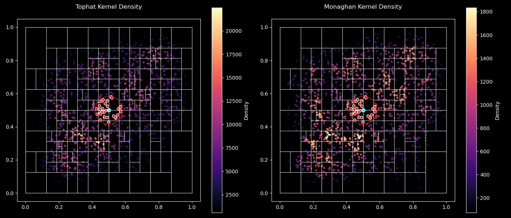

# K-d Tree for Density Estimation

This small script builds a K-d tree in a periodic domain filled with superparticles at random positions, in roder to do a K nearest neighbors search and estimate the density with the Tophat and the Monaghan kernels. This could be used for astrophysical SPH simulations.
