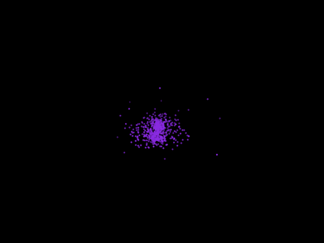

# N-body simulation



N-body simulation for the Computational Astrophysics course at the University of Zürich, with a number of random (super)particles. The animate.py file will create a mp4 video of the simulation.

## Requirements

On the Linux terminal, type:

```bash
	$ apt-get install python pip nvidia-cuda-toolkit

	$ pip install numpy matplotlib pillow
```

The use of nvc is because the code uses open-acc for the parallel computations when using the naive algorithm for the forces.

## Usage

The number of particles N is defined in the nbodyheader.h file. After changing it, re-compile with make. Run the Barnes-Hut option with:

```bash
	$ ./main T3 1 softening opening
```

where 1 is only 1 bin (disregarding density results). Other options are commented on the code.

## Compilation

Inside the code directory, compile with make:

```
	$ make
```

## Reference

Springel, Volker. "High Performance Computing and Numerical Modelling." arXiv, 16 Dec. 2014. arXiv:1412.5187.
